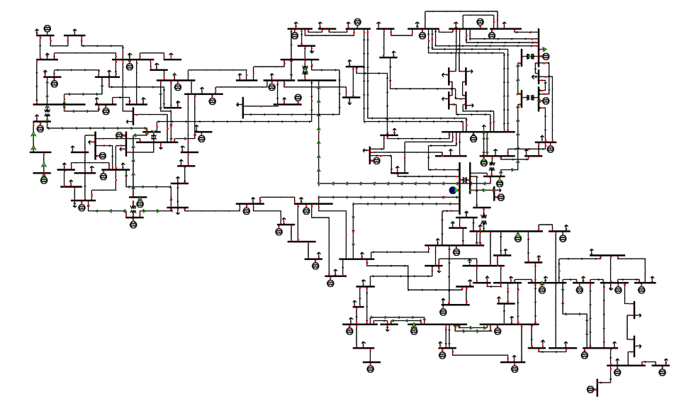

# Overview
## IEEE 118-Bus System
This IEEE 118-bus test case represents a simple approximation of the American Electric Power system (in the U.S. Midwest) as of December 1962. This IEEE 118-bus system contains 19 generators, 35 synchronous condensers, 177 lines, 9 transformers, and 91 loads [1].

The base KV levels in the bus names are a very rough guess. “The line MVA limits were not part of the original data and are made up. As a test case, this one has a lot of voltage control devices and is quite robust, converging in 5 or so iterations with a fast decoupled power flow” [2].

# Model Image

# References
[1] http://www.fglongatt.org/Test_Case_IEEE_118.html

[2] http://www.ee.washington.edu/research/pstca/pf118/pg_tca118bus.htm
