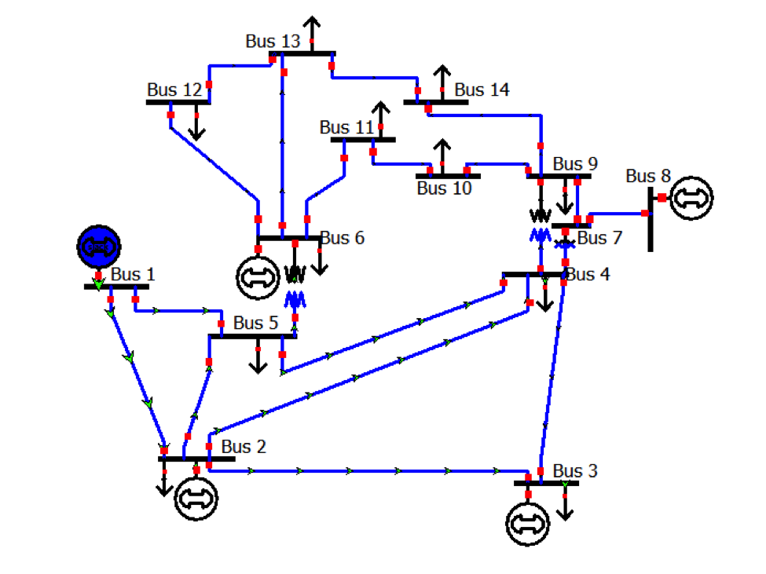

# Overview
## IEEE 14 Bus System
The IEEE 14-bus test case represents a simple approximation of the American Electric Power system as of February 1962 [1]. It has 14 buses, 5 generators, and 11 loads.

# Model Image

# References
[1] http://www.ee.washington.edu/research/pstca/pf14/pg_tca14bus.htm
