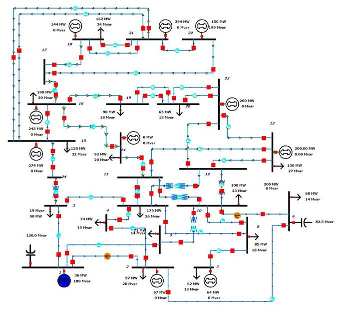

# Overview
## IEEE 24-Bus System
The IEEE 24-bus reliability test system was developed by the IEEE reliability subcommittee and published in 1979 as a benchmark for testing various reliability analysis methods. The three reliability test systems are IEEE one-area, IEEE two-area, and IEEE three-area.

# Model Image

# References
None
