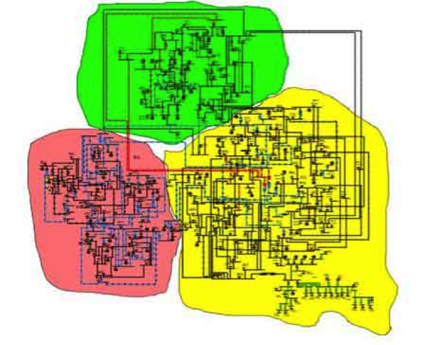

# Overview
## This IEEE 300-bus test case was “developed by the IEEE Test Systems Task Force under the direction of Mike Adibi in 1993” [1].

This IEEE 300-bus system contains 69 generators, 60 LTCs, 304 transmission lines, and 195 loads.

# Model Image

# References
[1] http://www.ee.washington.edu/research/pstca/pf300/pg_tca300bus.htm
