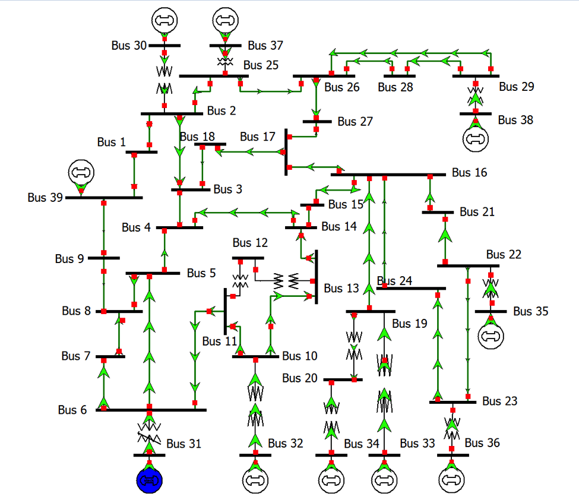

# Overview
## IEEE 39-Bus System
The “IEEE 39 bus system is well known as 10-machine New-England Power System. Generator 1 represents the aggregation of a large number of generators. All parameters shown below are taken from the book titled ‘Energy Function Analysis for Power System Stability’” [1][2]. The original paper with the IEEE 39-bus system is by T. Athay et al. [3]

The IEEE 39-bus system has 10 generators and 46 lines.

# Model Image

# References
[1] http://sys.elec.kitami-it.ac.jp/ueda/demo/WebPF/39-New-England.pdf

[2] Anantha Pai. Energy Function Analysis for Power System Stability. Springer, 1989. Cited in [1].

[3] T. Athay, R. Podmore, and S. Virmani, “A Practical Method for the Direct Analysis of Transient Stability,” IEEE Transactions on Power Apparatus and Systems, vol. PAS-98, no. 2, March/April 1979, pp. 573-584. Cited in [1].
