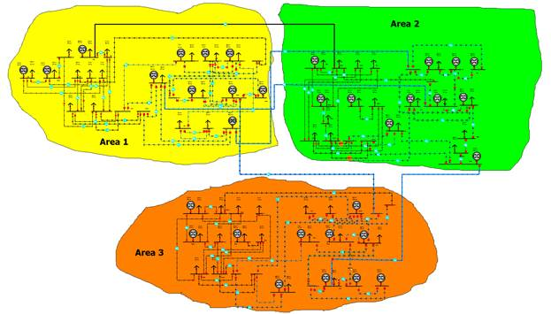

# Overview
## IEEE 96-RTS Test System
The IEEE 96-RTS System represents an enhanced test system used in bulk power system reliability evaluation studies. Bus data load, generations, and transmission lines parameters are driven from the paper: “The IEEE Reliability Test System -1996,” in IEEE Transactions on Power Systems, Vol. 14, No. 3, August 1999.

# Model Image

# References
None
