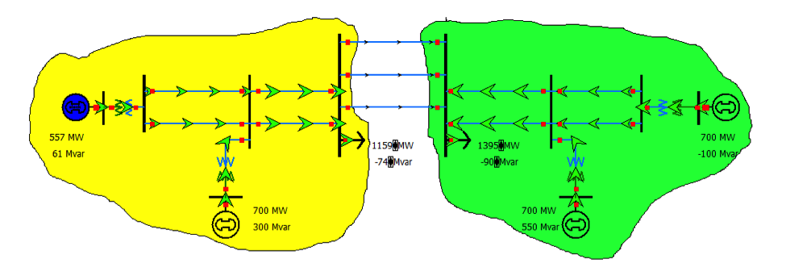

# Overview
## Two-Area System
The two-area system test case is from Prabha Kundur’s textbook Power System Stability and Control [1]. It is a test case used for studies on dynamic stability, power interchange, oscillation damping, etc. The system contains 11 buses, four generators, and two areas. The two areas are connected with weak tie lines.

# Model Image

# References
 [1] Prabha Kundur. Power System Stability and Control. McGraw-Hill Professional, 1994.
