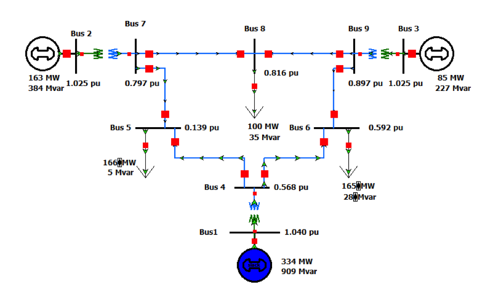

# Overview
## WSCC 9-bus
This WSCC 9-bus test case represents a simple approximation of the Western System Coordinating Council (WSCC) to an equivalent system with nine buses and three generators [1].

The base KV levels are 13.8 kV, 16.5 kV, 18 kV, and 230 kV. The line complex powers are around hundreds of MVA each. As a test case, the WSCC 9-bus case is easy to control, as it has few voltage control devices.

# Model Image

# References
[1] P28, http://www.scribd.com/doc/49081324/26/Western-System-Coordinating-Council-WSCC-3-Machines-9-Bus-system
