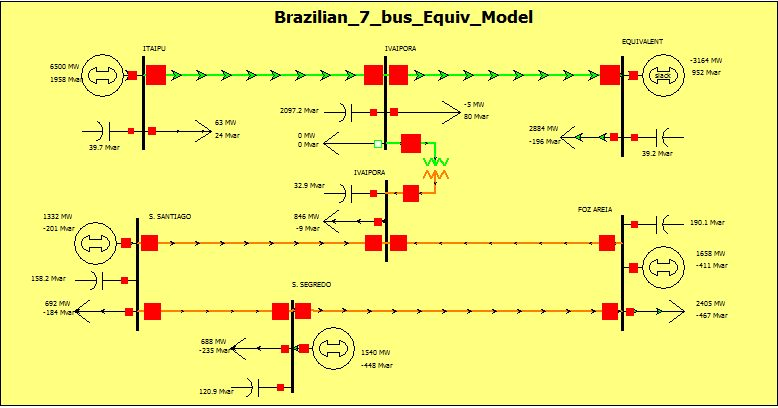

# Overview
## Brazilian Seven Bus System
This 7-bus, 5-machine equivalent model of the South-Southeastern Brazilian system configuration in the late 1980’s, disregarding the large HVDC Itaipu transmission system, has been used in several small-signal stability related works. This system has poor controllability without the power system stabilizers due to zeros in the vicinity of the critical electromechanical mode.

# Model Image

# References
None
