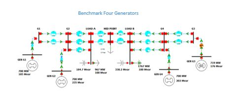

# Overview
## Two Area System
The 4-generators, two-areas, system is proposed in [1] P. Kundur, Power System Stability and Control, McGraw Hill, 1994. This test system is well-suited for the study of concepts related to the different nature of local and inter-area modes. Folder 1 contains the original case. Folders 2 and 3 includes test cases with PSSs without and with phase compensation tuning, respectively.

# Model Image

# References
None
