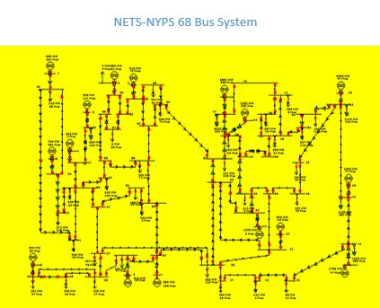

# Overview
## New England 68-Bus Test System
The 68-Bus, 16-Machine, 5-Area System is a reduced order equivalent of the inter-connected New England test system (NETS) and New York power system (NYPS), with five geographical regions out of which NETS and NYPS are represented by a group of generators whereas, the power import from each of the three other neighboring areas are approximated by equivalent generator models. This model was created after the 1965 blackouts and represents part of the power network of that region in the 1970s.

# Model Image

# References
None
