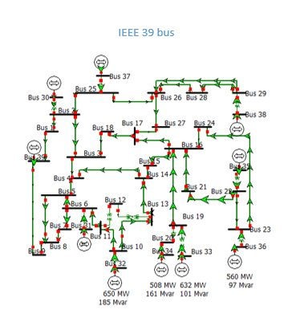

# Overview
## New England IEEE 39-Bus System
The IEEE 39-bus system analyzed in this report is commonly known as “the 10-machine New-England Power System.” This system’s parameters are specified in a paper by T. Athay et al [1] and are published in a book titled ‘Energy Function Analysis for Power System Stability'[2]. This case is used to study simultaneous damping of local and inter-are modes in a system with a highly symmetrical structure.

# Model Image

# References
[1] T. Athay, R. Podmore, and S. Virmani. "A Practical Method for the Direct Analysis of Transient Stability”. In: IEEE Transactions on Power Apparatus and Systems PAS-98 (2 Mar. 1979), pp. 573-584.

[2] M. A. Pai. Energy function analysis for power system stability. The Kluwer international series in engineering and computer science. Power electronics and power systems. Boston: Kluwer Academic Publishers, 1989.
