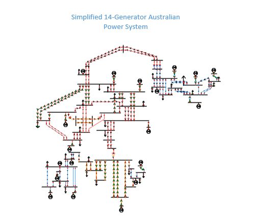

# Overview
## Simplified 14-Generator Australian Power System
The model of the 14-generator power system introduced here is loosely based on the southern and eastern Australian networks. This test system can be used as a test bed for the small-signal analysis and design of power system stabilizers (PSSs) and other controllers in a multi-machine power system. Six difference cases with different load levels and unit dispatch plans are given.

# Model Image

# References
None
