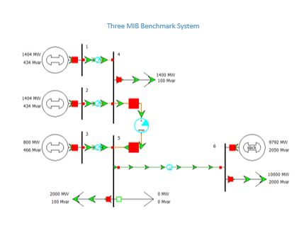

# Overview
## Three Machines Infinite Bus Benchmark System
The 3MIB benchmark system proposed in [1] is comprised of six buses and three generators. The 3-machine-infinite bus (3MIB) benchmark system is used for assessing the effectiveness of power system stabilizers to simultaneously contribute to the damping of electromechanical modes of different nature: from the intra-plant to the inter-area modes.

# Model Image

# References
[1] F. J. De Marco, N. Martins and J. C. R. Ferraz, “An automatic method for power system stabilizers phase compensation design,” IEEE Trans. on Power Systems, vol. 28, pp. 997 – 1007, May. 2013.
