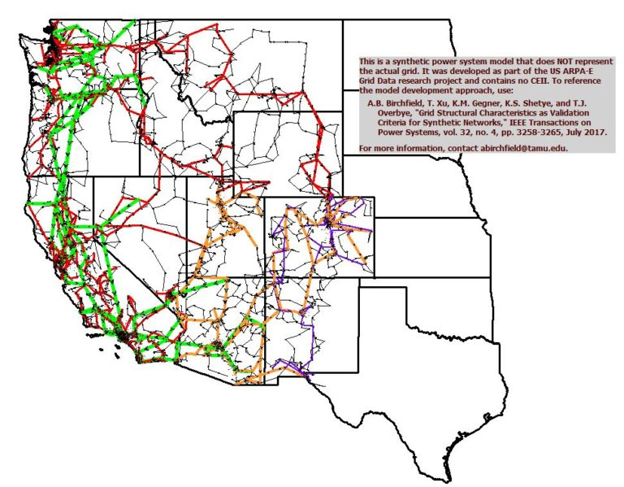

# Overview

## 10000-bus synthetic grid on footprint of western United States :ACTIVSg10k

The geographic footprint of this ACTIVSg10k test case selected corresponds to the U.S. portion of the Western Electricity Coordinating Council (WECC). There are sixteen areas and seven nominal voltage levels. It bears no relation to the actual grid in this location, except that generation and load profiles are similar, based on public data. The case includes power flow data as well as parameters for transient stability and geomagnetic disturbance studies. The case is provided in PowerWorld format, including binary (PWB/PWD), PowerWorld auxiliary text format, Matpower format, PSS/E raw format, and PSLF epc format.

## Model

[here](https://github.com/ITI/models/releases/download/ACTIVSg10k/ACTIVSg10k.zip)

## Model Image

## References

[Source](https://electricgrids.engr.tamu.edu/electric-grid-test-cases/activsg10k/)
