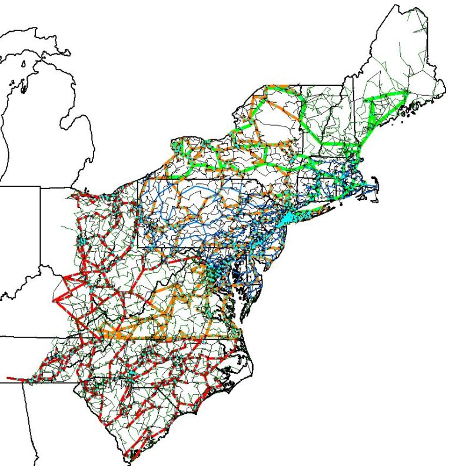

# Overview

## ACTIVSg25k: 25,000 bus synthetic grid on footprint of northeastern United States

The geographic footprint of this ACTIVSg25k test case corresponds to the northeast and mid-Atlantic regions of the United States. There are sixteen areas and nine nominal voltage levels. It bears no relation to the actual grid in this location, except that generation and load profiles are similar, based on public data. The case includes power flow data as well as parameters for transient stability and geomagnetic disturbance studies. The case is provided in PowerWorld format, including binary (PWB/PWD), PowerWorld auxiliary text format, Matpower format, PSS/E raw format, and PSLF epc format.

## Model

[here](https://github.com/ITI/models/releases/download/ACTIVSg25k/ACTIVSg25k.zip)

## Model Image

## References

[Source](https://electricgrids.engr.tamu.edu/electric-grid-test-cases/activsg25k/)
