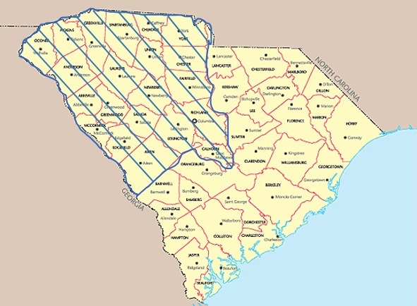
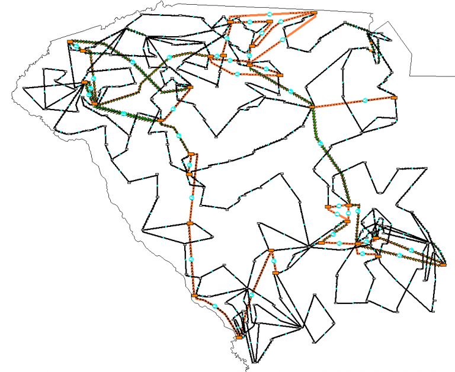

# Overview

## SouthCarolina 500-Bus System: ACTVISg500

The ACTIVSg500 case is a 500 bus power system test case that is entirely synthetic, built from public information and a statistical analysis of real power systems. It bears no relation to the actual grid in this location, except that generation and load profiles are similar.

The case is provided in PowerWorld format, Matpower format, PSS/E raw format, and PSLF epc format.

## Model Image

## References

[Source](https://electricgrids.engr.tamu.edu/electric-grid-test-cases/activsg500/)
