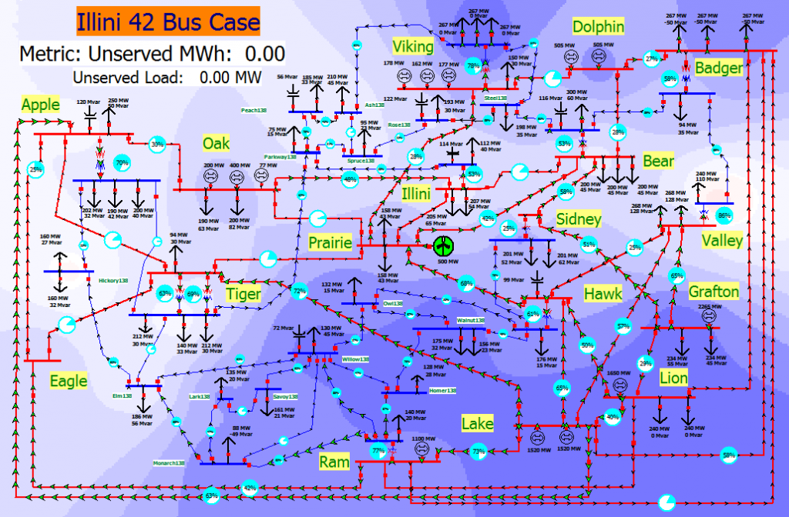

# Overview
## Illini 42 Tornado
The Illini 42 bus case models a 345/138 kV fictitious network. The scenario starts with the system in a reasonable operating condition. Then, within a minute a tornado by the Prairie Substation takes out three 345 kV transmission lines and forces a 500 MW wind farm off-line.

The scenario goal is to operate the system for five minutes without a system wide blackout. The key system controls are either opening loads or opening lines. The system metric is to avoid a blackout while minimizing the total unserved energy over the five minute scenario. Beware of generators tripping due to over excitation and transmission lines tripping due to over current! Without intervention, the system will experience a blackout in about 80 seconds.

The download link provides two cases with the same scenario, but with different refresh rates. Illini42 case has a refresh rate of 5 times per second, while the Illini42_Scada_Refresh_Rate case has a SCADA refresh rate of one every 6 seconds.

# Model Image

[Model Video](assets/interactive-power-system-dynamic-simulation-case.mp4)

# References
None
