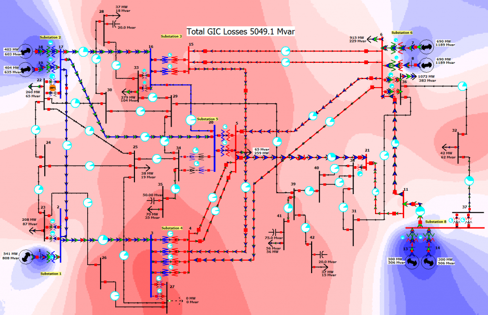

# Overview
## IlliniGMD 42 HEMP
The IlliniGMD 42 bus case models a 500/345/161 kV fictitious network. The scenario starts with the system in a reasonable operating condition. Then, within a few seconds a high altitude electromagnetic pulse (HEMP) E3 blast strikes the system, inducing large amounts of geomagnetically induced currents (GICs) in the system. The scenario goal is to operate the system for five minutes without a system wide blackout. The key system controls are either opening loads or opening lines. Beware of generators tripping due to over excitation and frequency violations and loads tripping due to voltage violations! Without intervention, the system will experience a blackout in about 70 seconds.

# Model Image

[Model Video](assets/illinigmd-42-hemp.mp4)

# References
None
