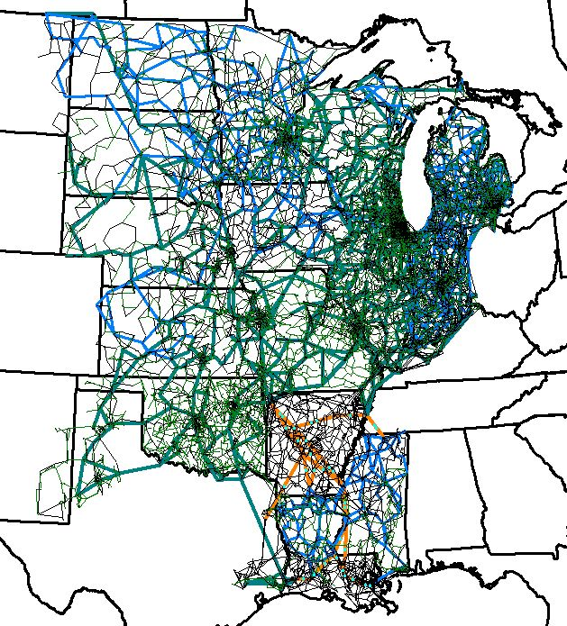

# Overview

## Midwest 27K

This 27163-bus network covers the geographic footprint of the combined systems of the Mid-Continent Independent System Operator (MISO) and the Southwest Power Pool (SPP) and serves 154 GW of peak load across multiple central U.S. states.

## Model Image

## References

[Source](https://electricgrids.engr.tamu.edu/electric-grid-test-cases/datasets-for-arpa-e-perform-program/)
