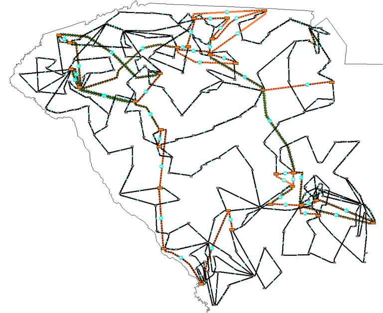

# Overview
## SouthCarolina500
The SouthCarolina500 case (also known as the ACTIVSg500 case) is a 500 bus power system  test case that is entirely synthetic, built from public information and a statistical analysis of real power systems. It bears no relation to the actual grid in this location,  except that generation and load profiles are similar.

The case is provided in PowerWorld format, Matpower format, PSS/E raw format, and GE PSLF epc format.

Please contact Adam Birchfield (birchfi2@illinois.edu)  for any questions regarding this case.

# Model Image

# References
None
