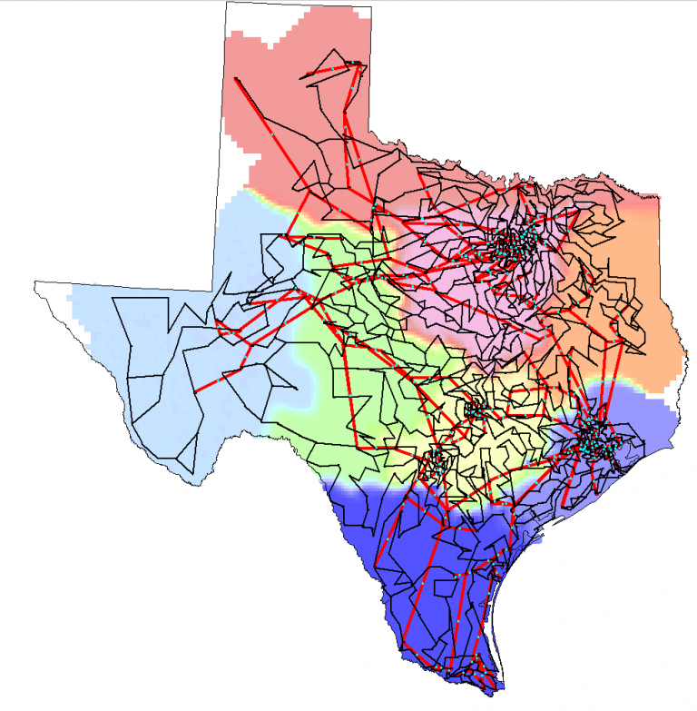

# Overview
## Texas 2000-June 2016
This 2000 bus power system test case is entirely synthetic, built from public information and a statistical analysis of real power systems.  It bears no relation to the actual grid in this location, except that generation and load profiles are similar, based on public data. A spreadsheet document contains the case’s specifications, including the areas, substations, buses, lines, transformers, generators, loads, and shunt devices. Benchmark power flow solutions are also given. The case is also provided in PowerWorld format, Matpower format, PSS/E raw format, and GE PSLF epc format.

# Model Image

# References
None
