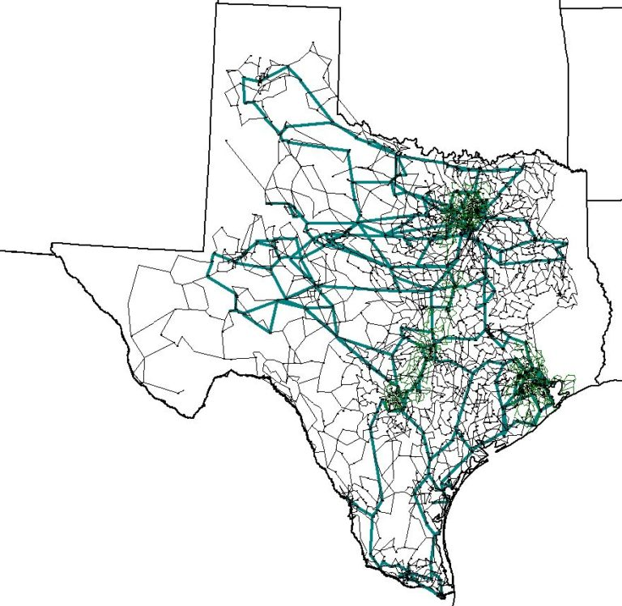

# Overview

## Texas7K

This 6717-bus network covers the geographic footprint of the electric reliability council of Texas (ERCOT) and serves 74 GW of peak load across the majority of the U.S. state of Texas.

## Model Image

## References

[Source](https://electricgrids.engr.tamu.edu/electric-grid-test-cases/datasets-for-arpa-e-perform-program/)
