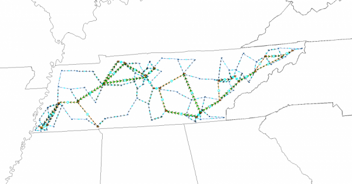

# Overview
## UIUC 150-Bus System
This 150-bus power system case contain substation geographic coordinates and other parameters useful for geomagnetic disturbance (GMD) studies. The case is entirely synthetic; it was created from public information and a statistical analysis of real power systems and bears no relation to the actual grid in this location besides similar load and generation distributions. Benchmark results are given for the power flow solution, geomagnetically induced currents (GIC), and steady state voltage stability in the presence of GICs. The case is given in PowerWorld format, Matpower format, and PSS/E raw format. The case data and benchmark results are given in a spreadsheet format.

# Model Image

# References
None
